# CyberRisk — Cyber Risk & GRC Platform

CyberRisk helps a security team or risk advisor answer four questions with evidence: **What do we have? What can go wrong? How well are we protected? What should we do first?**

It combines asset and vulnerability data, a risk register with deterministic scoring, control and compliance tracking, real public threat intelligence (NVD, CISA KEV, MITRE ATT&CK), log and incident analysis, a live integration simulator, and an AI assistant that is boxed in by guardrails and measured by automated evals.

> **One rule runs through everything.** SQLite and Python calculate every number (risk scores, coverage, priorities). The AI model only *explains* evidence it is handed and can never change a score, a compliance status, or a record. People make the final decisions.

---

## Verification & Test Status

The entire platform has been thoroughly tested and validated end-to-end:

| Test Suite | Scope | Status | Notes |
|---|---|---|---|
| **pytest Backend Suite** | `tests/` (204 tests) | **PASSED (204/204)** | Formulas, ETL, connectors, detections, APIs, guardrails, RAG, migrations, concurrency |
| **Playwright UI Smoke** | `scripts/ui_smoke.py` | **PASSED (11/11 pages)** | 0 console errors, 0 failed network requests, verified DOM aria landmarks |
| **Playwright User Flows** | `scripts/ui_flows.py` | **PASSED** | Multi-workspace onboarding, CSV auto-mapping, asset import, role views, threat detection |
| **Playwright Live Sim** | `scripts/ui_live.py` | **PASSED** | Real-time event streaming, ransomware storyline injection, multi-source incident correlation |

---

## Contents
1. [Quick start](#1-quick-start)
2. [Core concepts](#2-core-concepts) — workspaces, roles, data model
3. [The pages, one by one (Visual Walkthrough)](#3-the-pages-one-by-one)
   - [Overview Dashboard](#overview-dashboard)
   - [Natural Language AI Assistant](#natural-language-ai-assistant)
   - [Risk Register](#risk-register)
   - [Risk Detail & What-If Remediation](#risk-detail--what-if-remediation)
   - [Vulnerabilities & CISA KEV](#vulnerabilities--cisa-kev)
   - [Incidents & MITRE ATT&CK](#incidents--mitre-attck)
   - [Asset Inventory](#asset-inventory)
   - [Vendor Risk Management](#vendor-risk-management)
   - [Security Controls & Evidence](#security-controls--evidence)
   - [Compliance Posture](#compliance-posture)
   - [Assessment Reports](#assessment-reports)
   - [Analyze: Automated Log Forensics](#analyze-automated-log-forensics)
   - [Analyze: Incident Text NLP Classifier](#analyze-incident-text-nlp-classifier)
   - [Live Operations Simulation](#live-operations-simulation)
   - [Simulated Incident Forensics](#simulated-incident-forensics)
   - [AI Governance & Human Review](#ai-governance--human-review)
   - [Automated AI Evals](#automated-ai-evals)
   - [Data Pipeline & Threat Intelligence](#data-pipeline--threat-intelligence)
   - [Universal CSV Import Wizard](#universal-csv-import-wizard)
   - [Multi-Tenant Workspace Manager](#multi-tenant-workspace-manager)
   - [Getting Started Setup Checklist](#getting-started-setup-checklist)
   - [System Settings & Audit Log](#system-settings--audit-log)
4. [How the numbers are calculated](#4-how-the-numbers-are-calculated)
5. [Data pipeline and the import wizard](#5-data-pipeline-and-the-import-wizard)
6. [Analyze: logs and incidents without an organisation](#6-analyze-logs-and-incidents-without-an-organisation)
7. [Live operations (simulation)](#7-live-operations-simulation)
8. [The AI layer: RAG, guardrails, governance, evals](#8-the-ai-layer)
9. [Honest limits](#9-honest-limits)

---

## 1. Quick start

Windows PowerShell:

```powershell
python -m venv .venv
.\.venv\Scripts\Activate.ps1
pip install -r requirements.txt
copy .env.example .env             # add ONE LLM key, see section 9 (optional: the app works without one)
python -m app.demo.setup           # builds the demo workspace (~1 min, needs internet; add --offline to use cached data)
uvicorn app.main:app --reload      # open http://localhost:8000
```

What `app.demo.setup` does: creates the database, downloads public data (NVD, CISA KEV, MITRE ATT&CK), loads the framework catalogue, generates a synthetic organisation (seed 42), runs it through the real ETL, calculates every score, and ingests the knowledge base for AI retrieval. It reports exactly which sources succeeded or failed.

Useful commands:

| Command | Purpose |
|---|---|
| `pytest` | 204 automated unit & API tests; they never contact a real LLM, whatever your `.env` says |
| `python -m app.evals.run` | AI evals: live against your model if a key is set, otherwise guardrails-only |
| `python -m app.evals.run --mode live --baseline` | store this run as the baseline future runs are compared with |
| `python -m app.etl.acquire --source nvd\|cisa-kev\|mitre\|nist` or `--all` | refresh public data (`--limit`, `--start-date`, `--end-date`, `--force`, `--skip-existing`, `--dry-run`) |
| `python scripts/ui_smoke.py <dir>` / `ui_flows.py` / `ui_live.py` | Playwright browser test suite (requires running server and Edge/Chromium) |
| `python scripts/generate_all_screenshots.py` | regenerate all application screenshots into `docs/screenshots/` |

---

## 2. Core concepts

### Workspaces (tenants)
A **workspace** is an isolated environment: its own SQLite database file (`data/workspaces/<slug>/cyberrisk.db`) and its own uploads. Every API call carries an `X-Workspace` header (the browser sets it from the switcher), and the server binds each request to exactly one database. Data cannot leak between workspaces.

| Kind | Purpose | Contents |
|---|---|---|
| **Demo** | Explore everything immediately | Synthetic company "Acme Corp" (~200 assets, ~700 vulnerability findings, 40 risks, 66 controls, vendors, incidents, evidence) + real public data |
| **Organization** | A customer or engagement | Starts **empty** (or pre-loaded with synthetic demo data if you choose). Gets a copy of the public threat data and framework controls; your assets, risks, control status and evidence are yours |
| **Sandbox** | Analyse logs/incidents with **no organisation at all** | Only the Analyze, AI Governance, Evals, Data Pipeline and Settings pages |

Create/open/delete workspaces from the **Workspace** button at the top of the sidebar. Deleting requires typing the workspace id. Older workspaces are upgraded automatically the first time they are opened after an update.

### Role views
The **View as** selector reorders the navigation for a job and chooses the landing page. It is a convenience, **not access control** (there is no login yet).

| Role | Focus pages |
|---|---|
| Risk advisor / GRC | Getting started, Overview, Risks, Controls, Compliance, Assets, Reports, Vendors |
| Security analyst | Analyze, Live operations, Vulnerabilities, Incidents, Assets, Data Pipeline, Risks |
| Executive | Overview, Risks, Compliance, Reports, Vendors |

Everything else is still reachable under "More".

### The data model in one picture
```
assets ──< vulnerabilities >── cve_catalog (NVD) ── kev_entries (CISA)
   │  └──< incidents ── technique_ids ── attack_techniques (MITRE)
   └──< risks ──< remediation_actions
         │  └──< risk_history (score over time)
         └──< risk_controls >── controls ── frameworks (NIST CSF, ISO 27001, SOC 2)
                                   └──< evidence
vendors ──< vendor_findings        employees (MFA adoption)
signals (simulation) ── incidents  analyses (log/incident analysis results)
etl_runs ──< etl_rejections        source_registry (provenance)    audit_log
documents ──< document_chunks (RAG)    ai_interactions ── ai_approvals    ai_eval_runs ──< ai_eval_cases
```

---

## 3. The pages, one by one

### Overview Dashboard
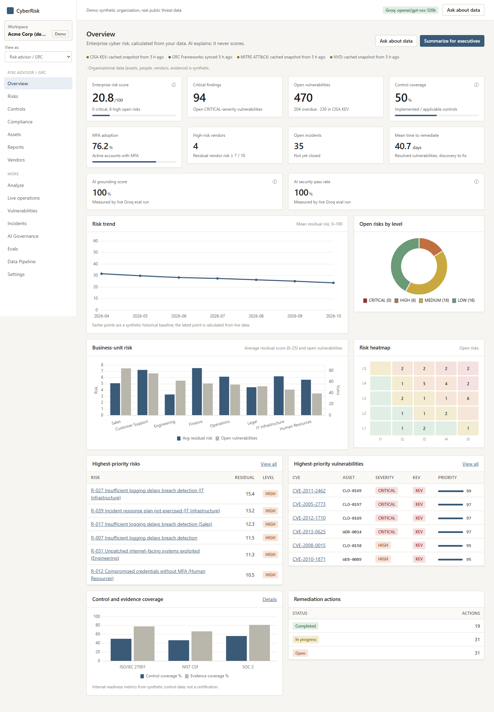

The central command dashboard for leadership and security teams. Every figure is calculated live from SQLite via deterministic queries:
- **Enterprise Risk Score (0–100)**: Headline composite index (0.7 × average residual risk + 0.3 × percentage of high/critical risks).
- **Core KPIs**: Critical open findings, active vulnerabilities (with overdue and CISA KEV counts), and global control coverage.
- **Operational Metrics**: Enterprise MFA adoption percentage, count of high-risk third-party suppliers, open security incidents, and Mean Time to Remediate (MTTR).
- **AI Health Indicators**: Real-time grounding score and safety eval pass rates (labelled *Measured* when evaluated, or *Not measured yet*).
- **Interactive Visualizations**: Monthly residual risk trend, risk distribution by severity tier, business-unit risk vs open vulnerabilities scatter, likelihood × impact 5×5 risk matrix heatmap, and control implementation vs evidence coverage per framework.
- **Threat Freshness Tracker**: Bottom telemetry strip showing sync status, record count, and caching state for public NVD, CISA KEV, and MITRE feeds.

---

### Natural Language AI Assistant
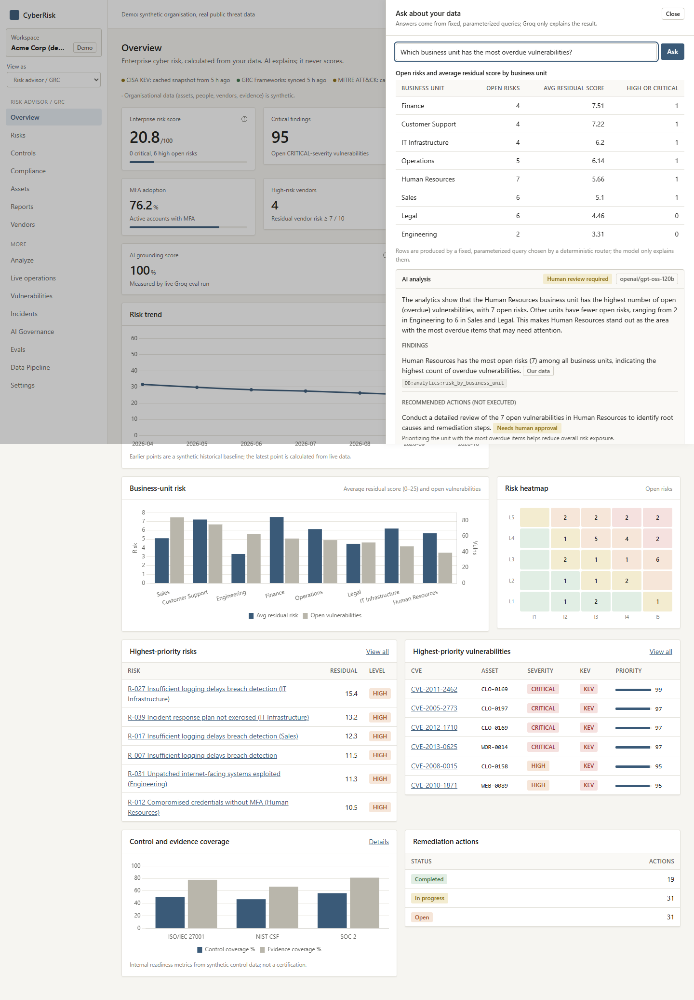

The **Ask about data** slide-out panel delivers conversational intelligence without hallucinated SQL:
- **Zero Raw SQL Generation**: Operates through a deterministic router mapped to 10 safe parameterized SQL analytics templates (e.g. overdue vulnerabilities by department, KEV exposure, risk distribution).
- **Explain-Only AI**: The AI model never queries the database directly. It receives sanitized SQL rows and explains the statistical patterns.
- **Traceable Findings**: Every statement in the response links back to specific row IDs and data points.
- **Input Guardrails**: Prompt injections, attempts to alter database states, and PII leaks are blocked before hitting the model.

---

### Risk Register
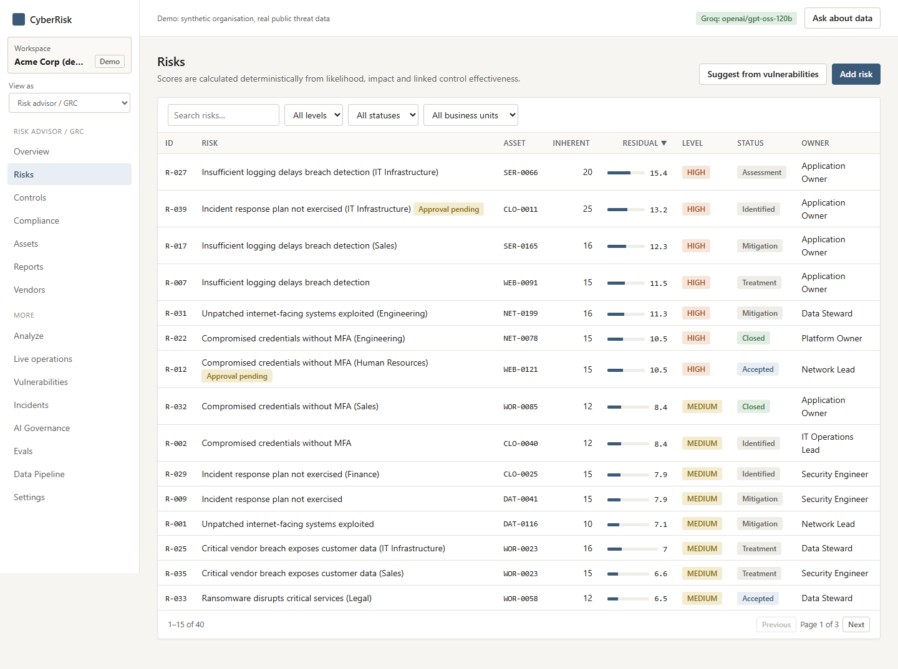

The master repository of operational, technical, and regulatory risks:
- **Deterministic Risk Scoring**: Each risk displays inherent score (`Likelihood × Impact`), control mitigation strength, and calculated residual score (`1–25`).
- **Rich Multi-Criteria Filtering**: Instantly filter by severity level (`CRITICAL`, `HIGH`, `MEDIUM`, `LOW`), lifecycle status, or department/business unit.
- **Human Approval Indicators**: Risks with proposed acceptance status carry distinct `Approval pending` badges until an authorized risk owner signs off.
- **Automated Suggestions**: The *Suggest from vulnerabilities* tool inspects assets with unpatched critical CVEs or KEV entries and proposes candidate risks.

---

### Risk Detail & What-If Remediation
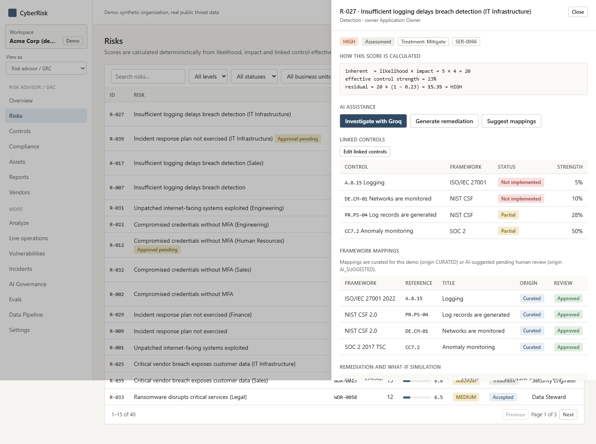

Clicking any risk opens an in-depth slide-out drawer providing full auditability:
- **Mathematical Transparency**: Clear breakdown showing inherent score, linked control effectiveness, and formulaic residual score.
- **Linked Controls**: Direct association with NIST CSF, ISO 27001, and SOC 2 controls that actively mitigate the risk.
- **Historical Trajectory**: Embedded trend chart displaying residual score progression over time across past quarters.
- **What-If Remediation Simulation**: Select prospective remediation actions and run interactive projections to model expected residual score drops and enterprise index improvements without altering live records.
- **Governance Controls**: Formal approval workflow for risk acceptance, requiring reviewer identity and recorded rationale.

---

### Vulnerabilities & CISA KEV
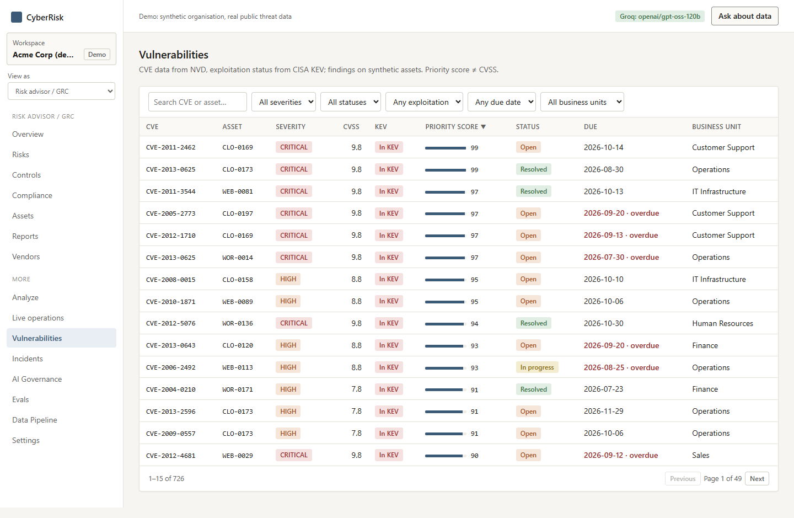

Consolidated technical vulnerabilities enriched with authoritative threat intelligence:
- **Real NVD CVE Enrichment**: Official descriptions, CVSS v3.1 base scores, vector strings, and CWE classifications.
- **CISA KEV Integration**: Real-time correlation with CISA's Known Exploited Vulnerabilities catalog, highlighting active in-the-wild exploitation and ransomware links.
- **CyberRisk Priority Score (0–100)**: Multi-factor formula combining technical CVSS, asset criticality, network exposure, and KEV exploit status.
- **SLA & Remediation Status**: Tracks discovery date, due date, overdue status, affected host, and remediation stage (`OPEN`, `IN_PROGRESS`, `RESOLVED`).

---

### Incidents & MITRE ATT&CK
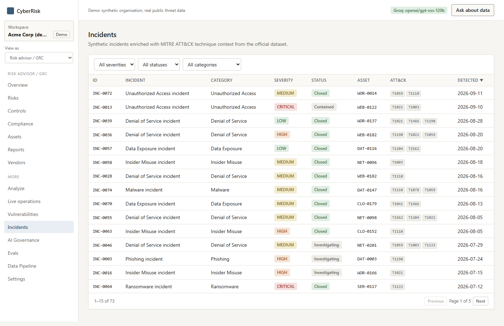

Incident management view mapping security events to attacker behaviors:
- **ATT&CK Technique Attribution**: Direct links to official MITRE ATT&CK techniques, tactics (e.g., Initial Access, Persistence, Impact), and technique IDs.
- **Severity & Impact Scope**: Track incident severity, containment status, affected assets, and impacted business units.
- **Timeline & Playbooks**: Structured timelines from initial trigger to containment, with associated investigation notes.

---

### Asset Inventory
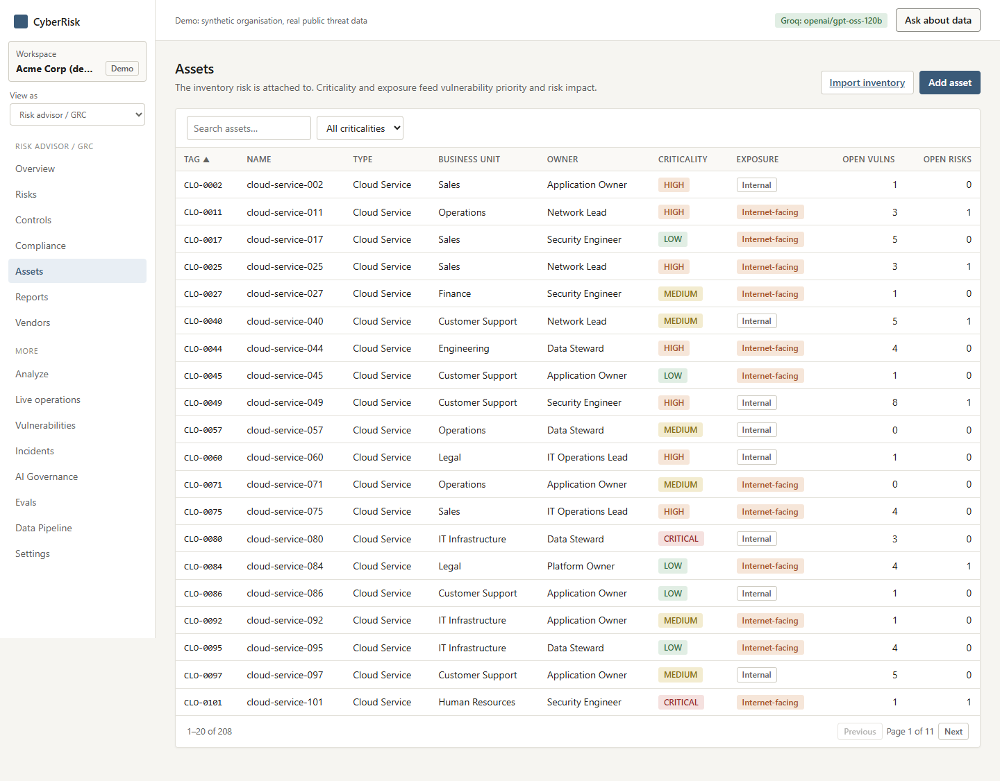

Comprehensive hardware and software inventory establishing the scope of risk:
- **Asset Criticality**: Stratification into Tier 1 (`CRITICAL`), `HIGH`, `MEDIUM`, and `LOW` classifications.
- **Exposure Flags**: Clear indicators for internet-facing systems vs. internal infrastructure.
- **Risk & Finding Aggregation**: Live counters displaying open vulnerabilities and active linked risks per asset.
- **Bulk Ingestion**: Direct integration with the universal CSV/JSON import wizard for CMDB synchronization.

---

### Vendor Risk Management
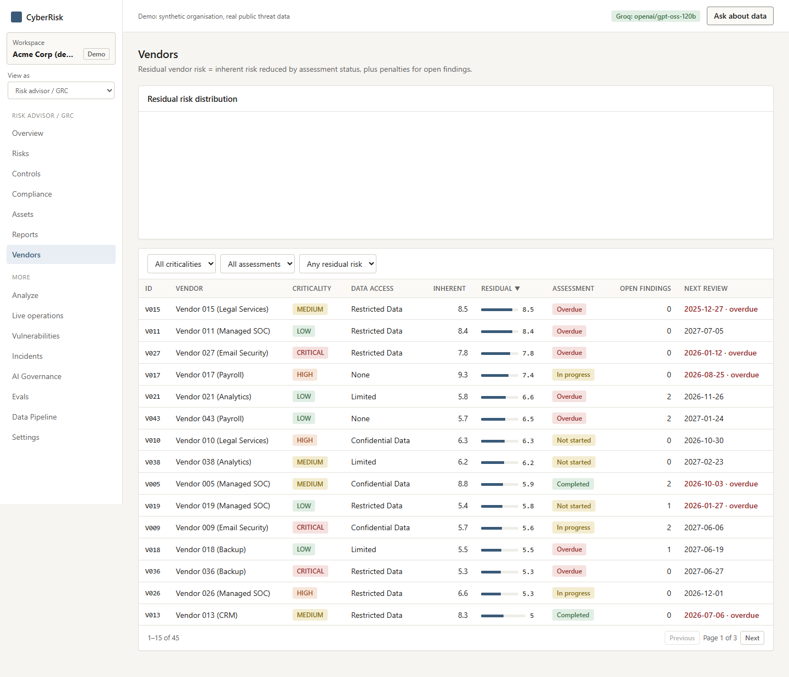

Supply-chain and third-party risk tracking:
- **Residual Third-Party Scoring**: Evaluates inherent risk, assessment completion status, and active vendor security findings.
- **Review Lifecycle**: Monitors annual assessment due dates, SOC 2 / ISO 27001 certificate expiries, and vendor tiering.
- **Findings Tracking**: Direct association with security issues identified during vendor questionnaires or audits.

---

### Security Controls & Evidence
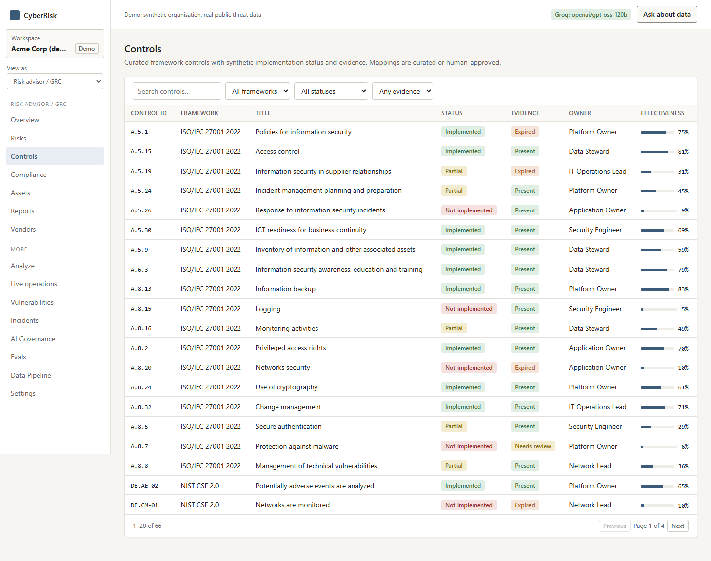

The central catalog of protective, detective, and corrective controls:
- **Multi-Framework Standards**: Curated control definitions spanning NIST CSF 2.0, ISO/IEC 27001:2022 Annex A, and SOC 2 Trust Services Criteria.
- **Implementation Status**: Explicit tracking (`IMPLEMENTED`, `PARTIAL`, `NOT_IMPLEMENTED`, `NOT_APPLICABLE`).
- **Quantitative Effectiveness (0–100%)**: Assessor-assigned mitigation percentages that directly compute risk reduction across linked risks.
- **Evidence Lifecycle**: Evidence collection with document links and expiration dates. Expired evidence automatically degrades control audit readiness.

---

### Compliance Posture
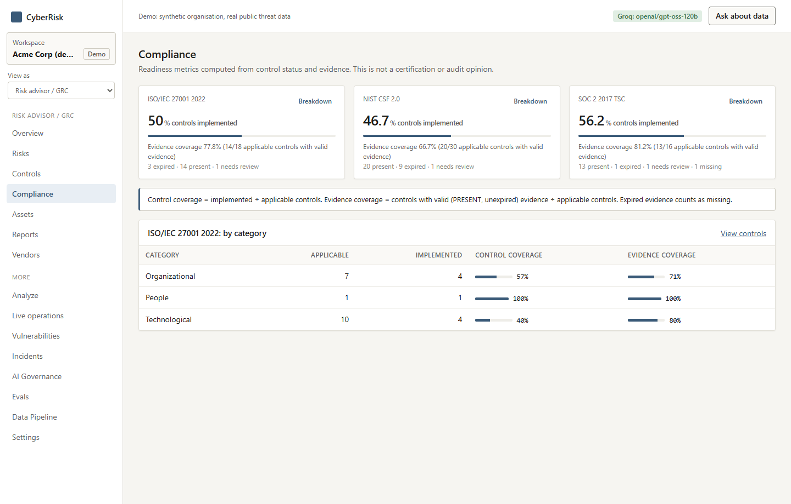

Objective framework readiness and audit posture evaluation:
- **Dual Metric Evaluation**: Separates **Control Coverage** (percentage of applicable controls implemented) from **Evidence Coverage** (percentage backed by valid, unexpired evidence).
- **Maturity Breakdowns**: Category-level readiness bars across NIST CSF Functions (Govern, Identify, Protect, Detect, Respond, Recover) and ISO 27001 clauses.
- **Gap Analysis**: Identifies controls with missing or expired evidence, highlighting audit vulnerabilities.

---

### Assessment Reports
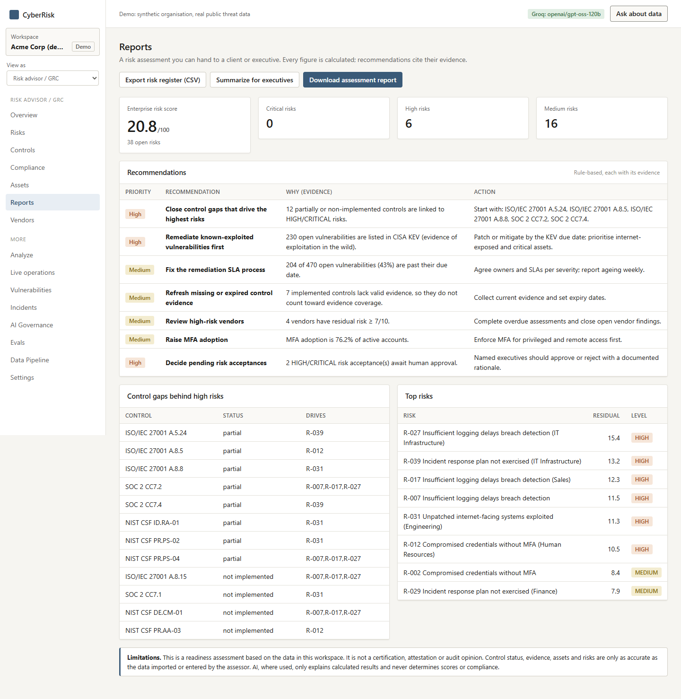

Client- and executive-ready reporting engine:
- **Executive Assessment Report**: Printable, self-contained HTML report with enterprise risk indices, top risks, control gaps, and data provenance.
- **Evidence-Based Recommendations**: Deterministic, rule-generated actions where every proposal explicitly cites the supporting data.
- **Risk Register CSV Export**: Formula-injection-safe export formatted for spreadsheet analysis.
- **Executive Summaries**: AI-assisted synthesis restricted to calculated figures and bounded by strict output schemas.

---

### Analyze: Automated Log Forensics
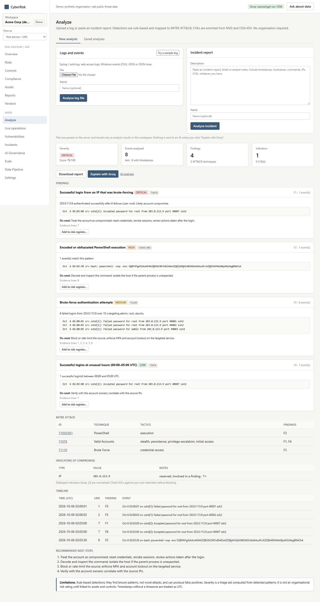

Standalone forensic log parser and detection engine (runs in all workspaces, including Sandbox, without requiring an organization):
- **Multi-Format Ingestion**: Supports Syslog, `auth.log`, web access logs, Windows Event CSVs (Event IDs 4624, 4625, 1102, etc.), and JSON/NDJSON.
- **18 MITRE ATT&CK Rules**: Automated detection of brute-force attacks, credential stuffing, privileged account changes, lateral movement, and encoded PowerShell execution.
- **Attack Chain Correlation**: Detects multi-stage activity such as successful authentication following repeated failed attempts from malicious IPs.
- **Artifact Extraction**: Extracts target users, source IPs, extracted timestamps, and raw matching lines.

---

### Analyze: Incident Text NLP Classifier
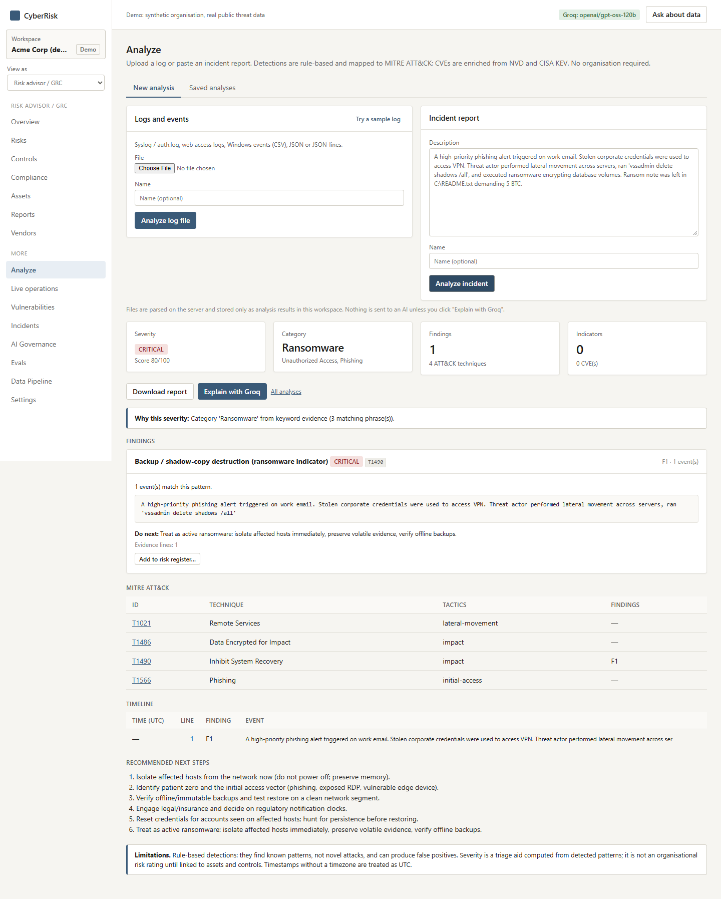

Heuristic and NLP analysis of unstructured incident tickets and forensic notes:
- **Automated Classification**: Categorizes incidents into Ransomware, Phishing, Data Breach, Credential Theft, or Insider Threat.
- **Explainable Severity Estimation**: Calculates severity with an itemized rationale (baseline category weight, escalation factors such as domain admin access or shadow copy deletion).
- **IoC Extraction**: Extracts public/private IPs, domain names, URLs (handling defanged formats like `hxxp://`), file hashes, and email addresses.
- **Incident Playbooks**: Generates category-specific response playbooks for containment, eradication, and notification.

---

### Live Operations Simulation
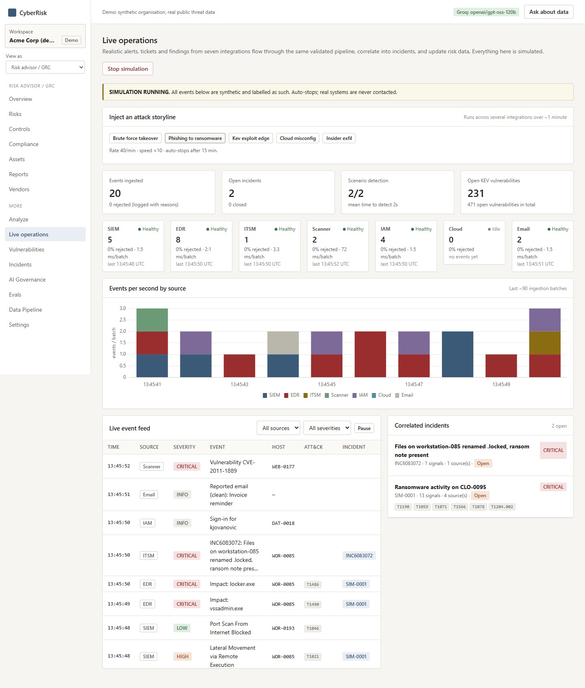

Real-time SOC operations simulator demonstrating streaming telemetry and correlation:
- **Multi-Source Event Streaming**: Emulates SIEM alerts, EDR telemetry, CloudTrail audit logs, Okta identity events, and vulnerability scan feeds.
- **Noise & Error Injection**: Includes baseline activity with ~3% corrupted and malformed events to exercise ETL validation.
- **Interactive Threat Storylines**: Inject real-world attack scenarios including *Phishing to Ransomware*, *Brute-Force Takeover*, *Cloud Misconfiguration*, and *KEV Exploit*.
- **Connector Health Metrics**: Live cards showing event volume, rejection percentages, ingestion latency, and degradation states.

---

### Simulated Incident Forensics
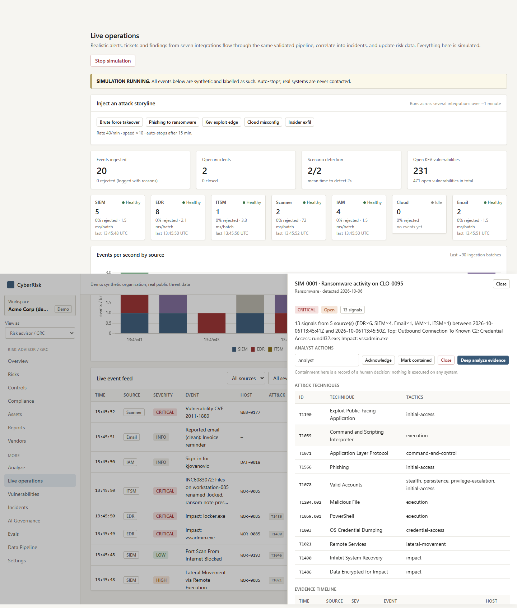

Drill down into incidents correlated in real-time from streaming telemetry:
- **Cross-Source Correlation**: Automatically correlates alerts sharing hosts, users, or external IPs within a 30-minute window.
- **Evidence Timeline**: Chronological kill-chain timeline tracing events from initial perimeter scan to lateral movement.
- **Analyst Workflow Actions**: Acknowledge incidents, record containment decisions, and dispatch raw logs to the Analyze engine.

---

### AI Governance & Human Review
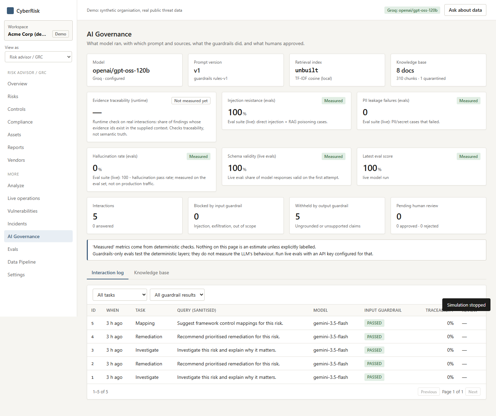

Complete transparency and oversight for all generative AI interactions:
- **Audit Logging**: Every AI request is permanently logged with sanitized inputs, model used, retrieved RAG passages, guardrail checks, and latency.
- **Guardrails Enforcement**: Displays real-time metrics on blocked injection attempts, PII redactions, and dropped RAG passages.
- **Human-in-the-Loop Approvals**: Suggestions affecting framework mappings, risk acceptance, or compliance remain in `Pending` review until signed off by a human analyst.
- **Knowledge Base Provenance**: View indexed policy chunks, retrieval embeddings, and quarantined adversarial documents.

---

### Automated AI Evals
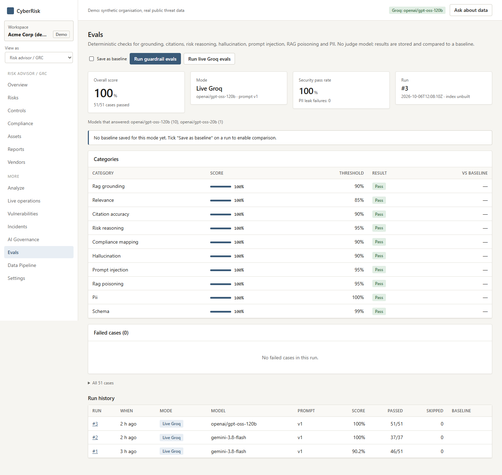

Built-in continuous evaluation framework ensuring AI safety, grounding, and accuracy:
- **Deterministic Test Harness**: Over 50 benchmark cases testing RAG grounding, prompt injection resistance, PII redaction, and schema compliance.
- **Threshold Enforcement**: Configurable quality gates (e.g., PII Redaction: 100%, Injection Resistance: ≥95%, Grounding: ≥90%).
- **Baseline Regression Tracking**: Compare current runs against saved baselines to detect degradation across model updates.

---

### Data Pipeline & Threat Intelligence
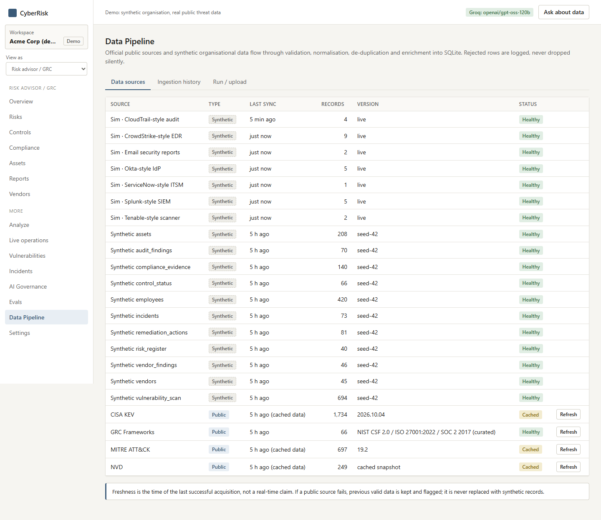

ETL orchestrator managing public threat feeds and organizational data:
- **Automated Threat Feeds**: Synchronizes with NVD CVE API 2.0, CISA KEV JSON, and MITRE ATT&CK STIX 2.1 repositories.
- **Data Provenance & Integrity**: Records SHA-256 checksums, version IDs, sync timestamps, and record counts in `source_registry`.
- **Ingestion History**: Detailed breakdown of every batch run showing records read, valid rows, duplicates, and rejection logs with exact error reasons.

---

### Universal CSV Import Wizard
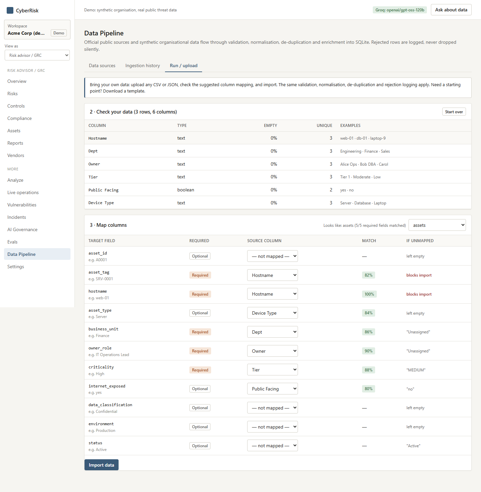

Self-service data onboarding wizard supporting 11 enterprise schemas:
- **File Profiling**: Instant statistical summary displaying column headers, non-empty percentages, distinct value counts, and automatic schema detection.
- **Intelligent Field Auto-Mapping**: Maps synonym headers (e.g., `Dept` → `business_unit`, `Tier` → `criticality`) with confidence indicators.
- **Type Normalization**: Parses and validates dates, severity strings, CVE identifiers, and boolean flags.
- **Rejection Isolation**: Invalid rows are quarantined with specific error messages without failing the valid records in the batch.

---

### Multi-Tenant Workspace Manager
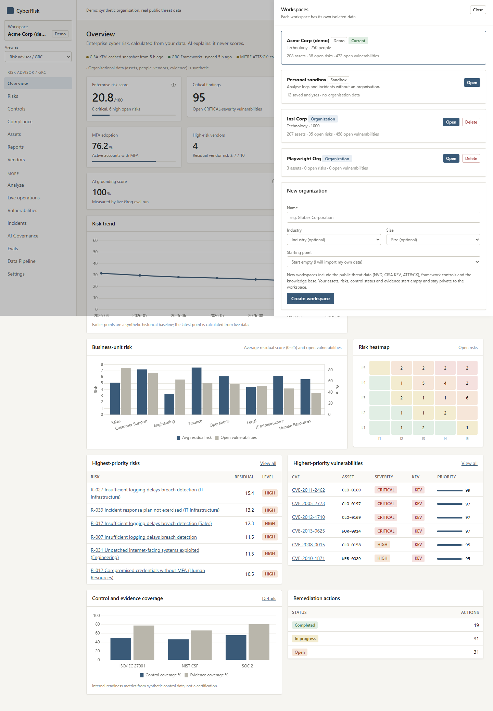

Multi-tenant workspace isolation manager:
- **Physical SQLite Isolation**: Every workspace maintains its own database file (`data/workspaces/<slug>/cyberrisk.db`), preventing data leakage.
- **Flexible Workspace Modes**:
  - **Demo Workspace**: Full synthetic dataset ("Acme Corp") for immediate exploration.
  - **Organization Workspaces**: Clean environments for individual enterprise clients with isolated inventories and registers.
  - **Sandbox**: Lightweight investigation environment for log and incident analysis without organization assets.
- **Safe Lifecycle Operations**: Deletion requires explicit workspace slug confirmation; automatic migrations upgrade older schemas on open.

---

### Getting Started Setup Checklist
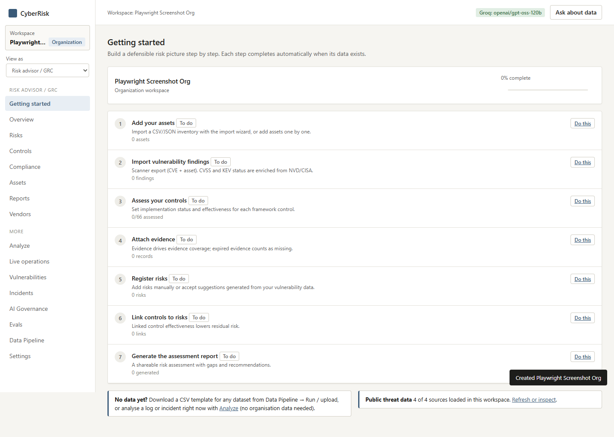

Deterministic 7-step onboarding checklist for new organizations:
1. **Add your assets** → 2. **Import vulnerability findings** → 3. **Assess your controls** → 4. **Attach evidence** → 5. **Register risks** → 6. **Link controls to risks** → 7. **Generate the assessment report**.
- **Database-Derived Progress**: Progress percentage is computed directly from live table counts, guaranteeing consistency.
- **Guided Navigation**: Provides step-by-step guidance and direct action buttons for each onboarding milestone.

---

### System Settings & Audit Log
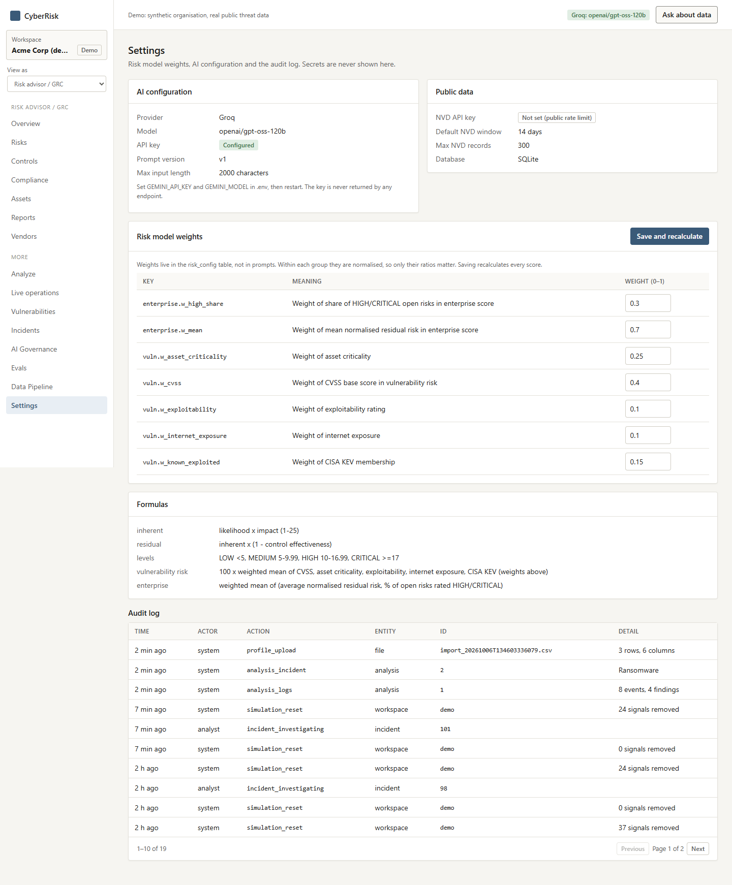

Administrative configuration and security audit trail:
- **AI Model Configuration**: Select primary provider (`auto`, `gemini`, `groq`), model version, and fallback model priorities.
- **Risk Model Calibration**: Adjust quantitative weights for vulnerability priority scoring (CVSS, asset criticality, exploitability, internet exposure, KEV presence). Saving triggers recalculation of all scores.
- **Immutable Audit Log**: Chronological log of administrative and analyst actions (risk updates, control assessments, approvals, imports).

---

## 4. How the numbers are calculated

All in `app/risk/engine.py` (pure functions, unit-tested for determinism).

**Risk**
```
inherent  = likelihood (1–5) × impact (1–5)                  → 1–25
residual  = inherent × (1 − mean effectiveness of linked, applicable controls)
level     = LOW <5 · MEDIUM <10 · HIGH <17 · CRITICAL ≥17
```
**Vulnerability priority (0–100)** = weighted mean of: CVSS/10 (0.40), asset criticality (0.25), exploitability (0.10), internet exposure (0.10), in CISA KEV (0.15). Weights live in the `risk_config` table and are editable in Settings (normalised within the group, so only ratios matter).

**Enterprise score** = 0.7 × mean(residual/25×100 over open risks) + 0.3 × (% of open risks rated HIGH/CRITICAL).

**What-if simulation**: each remediation action closes a fraction of the remaining control gap: `new_gap = gap × Π(1 − gain_i)`. Completed actions are already in the current effectiveness and are not counted twice.

**Compliance**: control coverage = implemented ÷ applicable; evidence coverage = controls whose evidence rolls up to PRESENT ÷ applicable.

**Vendors**: `residual = min(10, inherent × status factor + finding penalties)`; factor 0.6 completed assessment, 0.8 in progress, 1.0 overdue/not started; open findings add 0.6 / 0.4 / 0.2 for critical / high / medium. High-risk = residual ≥ 7.

**Approval rule**: a risk accepted (status ACCEPTED or treatment ACCEPT) while HIGH/CRITICAL moves to `approval_status = PENDING` until a human decides.

**Data quality score** = `100 − missing − invalid − 0.5×duplicates − referential-integrity penalties`, each penalty as a % of rows read.

---

## 5. Data pipeline and the import wizard

### Two kinds of source
| | Public | Organisational |
|---|---|---|
| Examples | NVD CVE API 2.0, CISA KEV, MITRE ATT&CK STIX, framework catalogue | Assets, vulnerability scans, incidents, vendors, employees, controls, evidence, risks |
| How | Official APIs/feeds; paginated, retried with backoff, raw snapshot saved, SHA-256 + version + timestamp recorded in `source_registry` | CSV/JSON through the ETL |
| If it fails | Previous data is kept and flagged; falls back to the latest cached snapshot **labelled as cached**; never replaced by synthetic data | Bad rows are rejected with a reason |

NVD is fetched as a bounded window (default last 14 days) plus the set NVD flags as KEV, never the whole database. The framework catalogue is a curated, version-controlled file (`app/grc/data/frameworks.json`).

### The ETL steps
extract (pandas) → **validate** (required fields, enums, ranges, dates, CVE format) → **normalise** (case, synonyms like `Tier 1`→CRITICAL / `Moderate`→MEDIUM, booleans, dates) → **referential checks** (e.g. a finding for an unknown asset is rejected as `[orphan]`) → **de-duplicate** on business keys → **load** (upsert) → **quality score** → **audit record**. **No row is silently dropped**: `read = valid + rejected + duplicates` holds for every run, and each rejection stores row number, reason and raw payload.

### Import wizard (Data Pipeline → Run / upload)
1. **Upload** a CSV/JSON (≤10 MB) or download a **template** for any of the 11 datasets.
2. **Profile**: column types, % empty, unique counts, examples, and a ranking of which dataset it most resembles.
3. **Map**: each target field gets a suggested source column with a confidence (exact name, synonym, partial match). Required fields without a default block the import. Unmapped optional fields use a stated default (e.g. status → `Active`, discovered date → today). Edit anything.
4. **Import**: dates in any common format are normalised to ISO; the result card shows read/loaded/rejected/duplicates, defaults applied, quality score, and links to the rejections.

Datasets: `assets, employees, vendors, vendor_findings, control_status, compliance_evidence, vulnerability_scan, incidents, audit_findings, risk_register, remediation_actions`. Vulnerability CVSS comes from NVD when the CVE is known, otherwise from your scanner column (blank + unknown CVE is rejected rather than guessed).

---

## 6. Analyze: logs and incidents without an organisation

Works in every workspace, including the sandbox. It is **deterministic and needs no AI**.

**Log analysis** parses syslog/auth.log, web access logs, Windows event CSV (event IDs 4624/4625/1102…), JSON and JSON-lines into normalised events, then runs **18 detection rules**, each mapped to ATT&CK:

| Group | Rules |
|---|---|
| Authentication | brute force (≥5 failures from one IP; ≥20 = high) · password spraying (≥5 accounts) · **successful login after brute force (critical)** · off-hours logins |
| Web | SQL injection · path traversal · XSS · attack-tool user agents · content scanning (≥15 distinct 404/403 paths) |
| Endpoint | encoded/obfuscated PowerShell · **shadow-copy deletion (ransomware)** · **credential dumping** · account creation / privileged group change · download-and-execute · log clearing · persistence (tasks/services) · lateral movement tools |
| Network | unusually large transfer |

URL-encoded payloads are decoded before matching. Each finding lists event count, evidence line numbers, sample lines, a recommendation, and entities (IPs, users).

**Incident analysis** takes free text: classifies the category by keyword evidence, estimates severity **with a written rationale** (category baseline, +1 for escalators like "domain admin"/"multiple systems", −1 for "false positive"/"blocked"), extracts a timeline, maps explicit and keyword-implied techniques, and gives a category playbook (containment, scoping, backups, notifications).

**Both** also: extract **IOCs** (IPs with public/private/reserved scope, domains, URLs, hashes, emails; defanged `hxxp`/`[.]` handled) · look up every CVE in the loaded **NVD/KEV data** (a KEV match raises its own finding) · resolve technique IDs to names/tactics · compute a score `100 × (1 − Π(1 − w))` with w = 0.60 critical, 0.35 high, 0.15 medium, 0.05 low (diminishing returns, order-independent) · produce a downloadable report.

Buttons on a result: **Explain with AI** (through the guarded pipeline, optional) and **Add to risk register…** (a human decision: likelihood from finding severity, impact from the chosen asset's criticality). Analysing never creates risks by itself. Limitations are printed on every result: rules find known patterns, not novel attacks, and can false-positive.

---

## 7. Live operations (simulation)

Shows what the pipeline does with a continuous stream. **Everything is synthetic and labelled**; no real vendor API or system is contacted.

**Sources** (structure imitates real product categories): SIEM alerts (Splunk-style), EDR detections (CrowdStrike-style), ITSM tickets (ServiceNow-style), vulnerability scanner findings (Tenable-style, using **real CVEs from your workspace's NVD/KEV data**), identity events (Okta-style), cloud audit logs (CloudTrail-style), reported phishing emails.

**Flow per batch (about once a second)**
1. Generate background noise at your chosen rate (plus any due storyline steps).
2. A ~3% share is deliberately corrupted, like real feeds.
3. Each source's **connector** validates and normalises its native format into a common signal; failures are **rejected with a reason**.
4. Scanner findings and security tickets are loaded through the **same ETL transforms as imports** (CVSS/KEV enrichment, asset resolution, orphan rejection, priority-score recalculation). Each batch is an **ingestion run** with a quality score, visible in Data Pipeline → Ingestion history.
5. Signals are stored (kept to the latest 5,000), hosts are resolved to assets; unknown hosts are flagged *not in inventory*.
6. The **correlator** links signals that share a host, a user, or an external IP over a 30-minute window. It opens an incident when there is at least one MEDIUM+ signal and either a CRITICAL signal, or total weight ≥ 6, or two sources with weight ≥ 4. **Low-severity noise alone never opens an incident.** Later evidence updates the same incident (severity, techniques, title and category follow the most advanced technique seen; three or more independent sources escalate severity by one level).

**Storylines** you can inject: *brute-force takeover*, *phishing → ransomware*, *KEV exploit on an edge device*, *cloud misconfiguration*, *insider exfiltration*. Each spans several integrations. The simulator records what it injected, so the page reports **scenario detection rate and mean time to detect**.

**The page**: start/stop controls (rate, storyline speed, duration, allowed storylines), integration health cards (events, % rejected, latency, last event; "degraded" needs ≥15 events and >20% rejects), KPIs, a stacked chart of events by source, the live feed (filter by source/severity, pause, click for raw evidence), and the correlated-incident panel. Open an incident to see its ATT&CK techniques and evidence timeline; **Acknowledge / Mark contained / Close** record an analyst decision (audit-logged; nothing is executed); **Deep analyze evidence** runs the Analyze engine on its raw events.

**Safety**: organization and demo workspaces only; ≤600 events/min, ≤2 h; auto-stops; one simulation per workspace. "Reset" removes simulated signals and incidents (assets and vulnerabilities loaded from the feed remain).

---

## 8. The AI layer

AI is a contextual helper, never the source of numbers. It supports **Gemini** or **Groq** (section 9).

### What each AI action does
| Action | Inputs given to the model |
|---|---|
| Investigate / Generate remediation | One risk's calculated scores, asset, linked controls and evidence status, top open vulnerabilities, related incidents, ATT&CK context, remediation actions + retrieved policy/framework passages |
| Suggest mappings | The risk + retrieved framework controls; results saved as **Pending** mappings |
| Summarize for executives | KPIs, top risks, compliance coverage, source freshness |
| Ask about data (natural-language analytics) | A **fixed set of 10 analytics intents** (vulnerabilities by severity, overdue by unit, KEV exposure, risk by unit, top risks, vendor risk, incidents, MFA, evidence, compliance). A deterministic router picks one; parameter-free SQL runs; the model only explains the returned rows. **The model never writes or runs SQL.** |
| Explain analysis | Findings, techniques, CVEs and IOC context from an Analyze result |

### The guarded path
```
question → INPUT GUARDRAIL → deterministic facts (each with an evidence id) → RAG retrieval
        → RAG GUARDRAIL → LLM (JSON mode) → OUTPUT GUARDRAIL (+1 repair attempt) → audit log → answer
```
- **Input guardrail**: length limit (2,000 chars), Unicode normalisation (defeats zero-width obfuscation), detection of prompt injection, system-prompt extraction, secret/bulk-data exfiltration, prohibited actions ("accept this risk", "set the score to 0") and fake-certification requests, **PII/secret redaction** (email, SSN, phone, Luhn-checked cards, Google/Groq/AWS keys…), and a security-scope check. Blocked text is not stored. Advisory questions ("which risks should we close first?") are allowed; imperative commands are not.
- **RAG**: documents are parsed, cleaned, chunked by section and indexed with TF-IDF cosine (a swappable `VectorStore` interface). Retrieval returns scored chunks with citations (title, section, id), at most two per document for diversity, and reports **low confidence** instead of guessing. Documents containing instruction-like text are **quarantined at ingestion**; retrieved text is fenced as *untrusted data*, and any passage that still looks like an instruction is dropped before the model sees it.
- **Output guardrail** rejects a response (it is withheld and logged) if it: fails the JSON schema; contradicts the calculated risk level; states a score that isn't in the facts; cites evidence/sources that weren't supplied; makes a framework claim without a knowledge-base source; mentions a control, technique or CVE id not in the context; contains secrets or PII; claims a certification; or claims it performed an action. Recommended actions touching acceptance or compliance are **forced** to require human approval. The model gets one repair attempt with the error list.
- **Abstention**: with no facts and no confident retrieval, the app answers "insufficient evidence" **without calling the model**.
- **Human approval**: mapping suggestions and executive summaries are flagged for review; an approver's name and decision are recorded. Approving mapping suggestions is the *only* way they reach "Approved".
- **Rate limit**: 30 AI requests/min per client.

### Evals
~50 cases across: RAG grounding, relevance, citation accuracy, risk reasoning, compliance mapping, hallucination, prompt injection (12 direct attacks incl. obfuscation), RAG poisoning (4, including a *subtle* one the rules miss so the model itself must resist), PII (7), schema.
- **Scoring is deterministic** (schema validity, evidence/citation checks, forbidden content, concept coverage, risk-value consistency). No judge model.
- **Guardrails-only mode** exercises the deterministic layers and skips cases that need the model (reported as *skipped*, never faked). **Live mode** runs end to end against your configured model.
- If the provider is down or out of quota, affected cases are **"not evaluated"** (excluded from scores, shown in the run), not counted as failures or passes.
- Thresholds are configurable (defaults e.g. grounding ≥90, injection ≥95, **PII = 100**). Mark a run as **baseline**; later runs flag regressions (drop >2 points, or crossing a threshold). Results are stored in SQLite.
- Sanity check on the evals themselves: disabling a guardrail makes the matching categories fail (covered by tests), so they can't pass vacuously.

---

## 9. Honest limits
- **No authentication.** Workspaces are isolated, but anyone who can reach the server can open any workspace. Role views are not permissions.
- **Impact and likelihood are assessor judgments.** There is no business-impact-analysis, risk-appetite, control-testing or FAIR-style quantification module; effectiveness is a single number you set.
- **Detections are rule-based** and will miss novel attacks and sometimes false-positive. The correlator is simple and deterministic; real SOC tooling is tuned far more.
- **Framework content is project-written summaries**, not the standards' text, and coverage figures are **not** a certification or audit opinion.
- **Organisational demo data is synthetic**; the simulator imitates product *structures* but calls no vendor API.
- **Guardrails are heuristic defence in depth**, measured by the eval suite but not a guarantee.
- SQLite and an in-process simulator suit a single-node deployment; scaling out would need a server database and an external job runner.
